::: {.callout-note title="Questions"}

- How do I plot my data?
- How do I customise a plot's appearance?
- How do I save a plot to a file?

:::

::: {.callout-note title="Objectives"}

- Create line plots, scatter plots, error bar plots, bar charts, and histograms with Matplotlib.
- Customise line styles, colours, and markers.
- Add axis labels, titles, and legends.
- Arrange multiple plots in a figure with subplots.
- Save figures to PDF and PNG files.

:::


## Matplotlib is Python's standard scientific plotting library

The most widely used scientific plotting library in Python is `matplotlib`. In practice you almost always work with the `pyplot` sub-module, imported with the alias `plt`. In a Jupyter Notebook, the `%matplotlib inline` magic ensures figures appear directly in the notebook output:

```python
%matplotlib inline
import matplotlib.pyplot as plt
```


## Basic line plots

`plt.plot(x, y)` draws a line connecting the data points. Always label your axes:

```python
import numpy
time = numpy.array([0, 1, 2, 3])
position = numpy.array([0, 100, 200, 300])

plt.plot(time, position)
plt.xlabel("Time (hr)")
plt.ylabel("Position (km)")
```

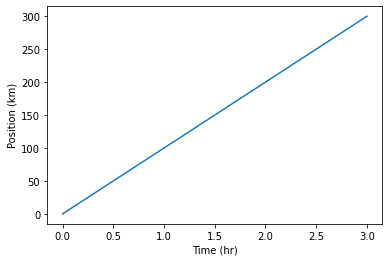{alt="Line plot of position in km versus time in hours, showing a linear increase from 0 to 300 km over 3 hours"}


## Controlling line and marker style

A compact format string as the third argument to `plt.plot` sets the colour and style together: `'b-'` means a blue line, `'ro'` means red circles, `'g+-'` means green plus-markers connected by a line:

```python
time = numpy.arange(10)
p1 = time
p2 = time * 2
p3 = time * 4

plt.plot(time, p1, 'b-')
plt.plot(time, p2, 'ro')
plt.plot(time, p3, 'g+-')
plt.xlabel("Time (hr)")
plt.ylabel("Position (km)")
```

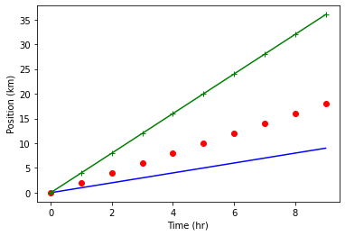{alt="Three position-versus-time series using different format strings: a blue line (p1), red circles (p2), and a green line with plus markers (p3)"}

For finer control, use keyword arguments instead. The `label` keyword feeds into `plt.legend()`:

```python
plt.plot(time, p1, color='blue', linestyle='-', linewidth=5, label="blue line")
plt.plot(time, p2, 'ro', markersize=10, label="red dots")
plt.plot(time, p3, 'g-', marker='+')
plt.xlabel("Time (hr)")
plt.ylabel("Position (km)")
plt.legend()
```

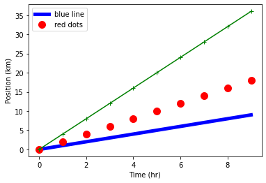{alt="Three position-versus-time series with a legend: a thick blue line, large red dots, and a green line with plus markers, demonstrating plot keyword arguments such as linewidth and markersize"}


## Built-in styles

Matplotlib ships with a set of named styles that control colours, fonts, and backgrounds consistently. List available styles with `plt.style.available` and apply one with `plt.style.use`:

```python
print("available style names: ", plt.style.available)
```
```output
available style names:  ['Solarize_Light2', '_classic_test_patch', 'bmh', 'classic', 'dark_background', 'fast', 'fivethirtyeight', 'ggplot', 'grayscale', 'seaborn-v0_8', ...]
```

```python
plt.style.use("seaborn-v0_8-whitegrid")
plt.plot(time, p1, linestyle='-', linewidth=5, label="blue line")
plt.plot(time, p2, 'o', markersize=10, label="dots")
plt.xlabel("Time (hr)")
plt.ylabel("Position (km)")
plt.legend()
```

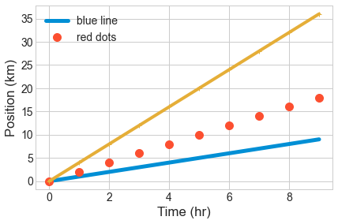{alt="The same three position-versus-time series rendered in the seaborn-v0_8-whitegrid style, showing a white background with light grey horizontal gridlines"}


## Scatter plots

When your data points should not be connected by a line, use `plt.scatter`. It accepts the same colour and marker keywords as `plt.plot`:

```python
numpy.random.seed(20)
x = numpy.cumsum(numpy.random.randint(0, 100, 100))
y = numpy.cumsum(numpy.random.randn(100))

plt.scatter(x, y)
plt.scatter(x, 10 - y**2, color='green', marker='<')
plt.xlabel("x")
plt.title("Scatter plot example")
```

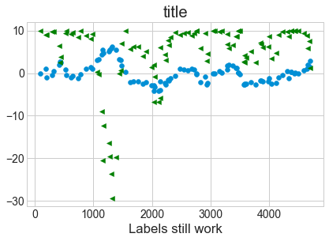{alt="Scatter plot with two series: blue dots and green left-pointing triangles, plotting cumulative sums of random data"}


## Error bars

In experimental physics you should always show measurement uncertainties. Use `plt.errorbar` with the `yerr` (and/or `xerr`) keyword. Set `ls=''` to suppress the connecting line and choose a marker explicitly:

```python
numpy.random.seed(42)
x = numpy.cumsum(numpy.random.rand(10) * 10)
error = numpy.random.randn(10) * 4
y = x + numpy.random.randn(10) * 0.5

plt.errorbar(x, y, yerr=error, color='green', marker='o', ls='', lw=1, label="data")
plt.xlabel("x")
plt.title("Error bar example")
plt.legend()
```

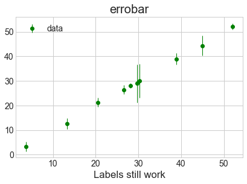{alt="Error bar plot of ten data points with green circle markers and vertical error bars, showing scattered y values near the x=y line with varying uncertainty"}


## Bar charts and histograms

`plt.bar` draws a bar chart from pre-counted data. `plt.hist` bins raw data and draws the resulting histogram in one step — it also returns the counts and bin edges if you need them:

```python
x = [0, 1, 2, 3, 4, 5]
y = [0, 4, 2, 6, 8, 2]
plt.bar(x, y)
plt.title("Bar chart")
```

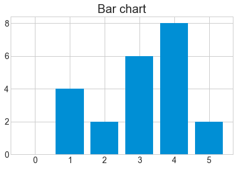{alt="Vertical bar chart with six bars of heights 0, 4, 2, 6, 8, and 2, titled Bar chart"}

```python
x = numpy.random.randint(0, 100, 50)
bin_count, bin_edges, boxes = plt.hist(x, bins=10, rwidth=0.9)
plt.title("Histogram")
```

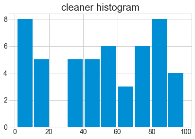{alt="The same histogram of 50 random integers with gaps between bars (rwidth=0.9), titled Histogram"}


## Controlling figure size

Call `plt.figure(figsize=(width, height))` before plotting to set the output size in inches:

```python
plt.figure(figsize=(8, 2))
plt.bar(x, y)
plt.title("Narrow bar chart")
```

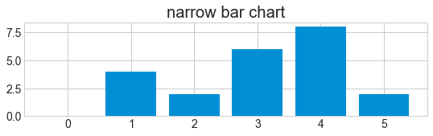{alt="Narrow bar chart 8 by 2 inches with six bars, demonstrating figsize to control figure dimensions"}


## Multiple panels with `subplot`

`plt.subplot(rows, cols, index)` selects one panel in a grid of panels. Subsequent `plt.plot` calls draw into the currently active panel:

```python
plt.figure(figsize=(8, 3))
x = [0, 1, 2, 3, 4, 5]
y = [0, 4, 2, 6, 8, 2]
plt.subplot(1, 3, 1)
plt.bar(x, y)
plt.title("left")
plt.subplot(1, 3, 2)
plt.bar(y, x)
plt.title("centre")
plt.subplot(1, 3, 3)
plt.bar(x, y)
plt.title("right")
```

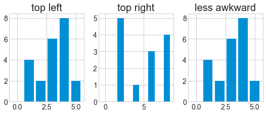{alt="Three bar charts arranged side by side in a 1 by 3 subplot row"}


## Saving figures

Call `plt.savefig` *before* the figure is displayed — once Matplotlib shows a figure it moves on to a new empty figure, and saving afterwards captures only a blank canvas. Supported formats include PDF, PNG, and SVG. For raster formats lke PNG use the `dpi` keyword to control resolution:

```python
plt.figure(figsize=(8, 3))
plt.plot(x, y)
plt.savefig("data/fig1.pdf")
plt.savefig("data/fig1.png", dpi=150, transparent=True)
```

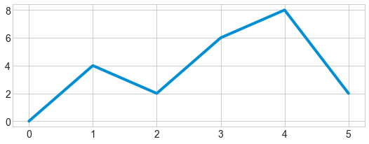{alt="Line plot of y values 0 4 2 6 8 2 against x values 0 through 5, produced for the savefig example"}

::: {.callout-note}
If you need to save after displaying, first capture a reference to the figure with `plt.gcf()` (get current figure), then call `savefig` on it:

```python
fig = plt.gcf()
plt.plot(x, y)
fig.savefig('my_figure.png')
```
:::


::: {.callout-tip title="Key Points"}

- Import `matplotlib.pyplot as plt`; use `%matplotlib inline` in Jupyter.
- `plt.plot` draws lines; `plt.scatter` draws unconnected points; `plt.errorbar` adds uncertainty bars.
- Format strings (`'b-'`, `'ro'`) or keyword arguments control colour, linestyle, and markers.
- Add `plt.xlabel`, `plt.ylabel`, `plt.title`, and `plt.legend` for readable figures.
- `plt.style.use` applies a consistent visual style.
- `plt.figure(figsize=...)` sets figure dimensions; `plt.subplot` creates multi-panel layouts.
- Call `plt.savefig` before the figure is displayed to avoid saving a blank canvas.

:::
