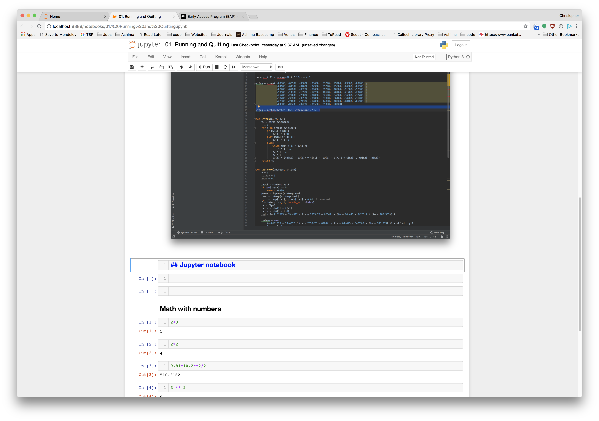

::: {.callout-note title="Questions"}

- How can I run Python programs?

:::

::: {.callout-note title="Objectives"}

- Launch the Jupyter Notebook, create new notebooks, and exit the Notebook.
- Create Markdown cells in a notebook.
- Create and run Python cells in a notebook.

:::

## Python programs are plain text files.

Python programs are stored as plain text files, conventionally given the `.py` extension so that both the operating system and other people can recognize them as Python code — though this is a convention rather than a strict requirement. While a standard text editor is a common tool for writing Python, these tutorials use the Jupyter Notebook instead. That extra setup is worthwhile because the Notebook provides some code completion and other helpful features that make learning easier. Notebooks are also interactive so figures and calculations printed immediately. Notebook files have the `.ipynb` extension to distinguish them from plain-text `.py` files, and they can be exported as pure Python scripts whenever you need to run them from the command line, or `.pdf` files to preserve the code and figures together.

## Running a Python program.

All Python programs are run by the Python interpreter that you need to [install](../learners/setup.html). On many computers a version of Python will already be installed and should have the correct packages you need.

To run the jupyter notebook, either use the `Anaconda Navigator` program to start the notebook or (on Mac and Linux) start a terminal and run `jupyter notebook` to start the program.

Running this command starts a Jupyter Notebook server and opens your default web browser. The server runs entirely on your local machine and requires no internet connection — it does the computational work while your browser handles rendering the notebook. You type code into the browser, and the results appear as the page communicates with the server.

This approach has several practical advantages. You can easily type, edit, and copy blocks of code, and tab completion lets you quickly access the names of variables, functions, and modules while learning more about them. You can also annotate your code with links, headings, and formatted text to make your work more readable for yourself and your collaborators. Perhaps most usefully, figures are displayed directly alongside the code that produces them, keeping the full story of your analysis in one place.

## Alternatives

If you prefer not to run Jupyter Notebook locally, there are several hosted options. [syzygy.ca](https://syzygy.ca) provides Jupyter notebooks hosted by the Digital Research Alliance of Canada, and [jupyter.utoronto.ca](https://jupyter.utoronto.ca) offers a similar service for U of T users — both give you temporary cloud storage, so make sure to download copies of any files you want to keep.

For a more traditional coding environment, Integrated Development Environments (IDEs) such as Spyder, PyCharm, or VS Code let you write a Python script and run it directly within the same application. They also provide convenient extras like a file manager, a variable inspector that shows how values change as your program runs, and a dedicated output window for plots. If you prefer to work without any GUI at all, you can write Python in any plain text editor and run your script from the terminal with the `python` command.

## Jupyter notebook

Jupyter notebooks organize your work into individual cells, each of which can hold a chunk of Python code. You write and run one cell at a time, seeing the result before moving on — which makes it easy to build up an analysis step by step. Python keeps track of everything you have run in the current session, so variables and functions defined in earlier cells remain available in later ones. Just keep in mind that closing or restarting the notebook clears that memory and you will need to re-run your cells from the top.

{alt="Example Jupyter Notebook"}

::: {.callout-tip title="Key Points"}

- Python programs are plain text.
- Use the Jupyter Notebook for editing and running Python.
- The Notebook has Command and Edit modes.
- Use the keyboard and mouse to select and edit cells.
- The Notebook will turn Markdown into pretty-printed documentation.
- Markdown does most of what HTML does.

:::

