## `matplotlib` is the most widely used scientific plotting library in Python

* Usually using a sub-library called matplotlib.pyplot. imported using the alias `plt`
* The Jupyter Notebook will render plots inline if we ask it to using a “magic” command.


```python
%matplotlib inline
import matplotlib.pyplot as plt
```

* Simple plots are then (fairly) simple to create.


```python
import numpy
time = numpy.array([0,1,2,3])
position = numpy.array([0,100,200,300])

plt.plot(time, position)
plt.xlabel("Time (hr)")
plt.ylabel("Position (km)")
```


    Text(0, 0.5, 'Position (km)')


    
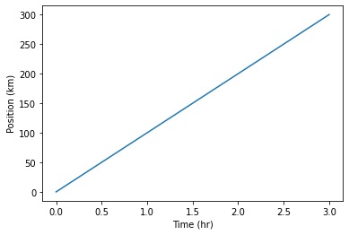
    


## The color and format of lines and markers can be changed.
* A shortcut for simple formatting is to use the third argument string.
* 'b-' means blue line, 'ro' means red circles, 'g+-' means green + with a line


```python
import numpy
time = numpy.arange(10)
p1 = time
p2 = time*2
p3 = time*4

plt.plot(time, p1,'b-')
plt.plot(time, p2,'ro')
plt.plot(time, p3,'g+-')
plt.xlabel("Time (hr)")
plt.ylabel("Position (km)")
```


    Text(0, 0.5, 'Position (km)')


    
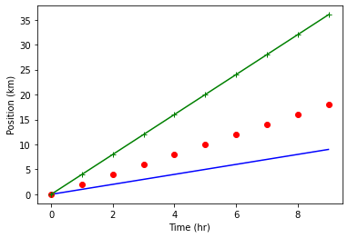
    


## More complex formatting can be achieved using the `plot` keywords 
* `linewidth` controls the thickness of the line
* `linestyle` controls the type of line
* `marker` controls the shape of the marker
* `color` controls the color of the line and marker
* `label` controls the labelling of the line for use with `plt.legend`


```python
plt.plot(time, p1,color='blue', linestyle='-', linewidth=5,label="blue line")
plt.plot(time, p2,'ro', markersize=10, label="red dots")
plt.plot(time, p3,'g-', marker='+')
plt.xlabel("Time (hr)")
plt.ylabel("Position (km)")
plt.legend()
```


    <matplotlib.legend.Legend at 0x7f8cf05c3340>


    
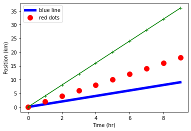
    


## Built in "styles" provide consistent plots


```python
print("available style names: ", plt.style.available)
```

    available style names:  ['Solarize_Light2', '_classic_test_patch', 'bmh', 'classic', 'dark_background', 'fast', 'fivethirtyeight', 'ggplot', 'grayscale', 'seaborn', 'seaborn-bright', 'seaborn-colorblind', 'seaborn-dark', 'seaborn-dark-palette', 'seaborn-darkgrid', 'seaborn-deep', 'seaborn-muted', 'seaborn-notebook', 'seaborn-paper', 'seaborn-pastel', 'seaborn-poster', 'seaborn-talk', 'seaborn-ticks', 'seaborn-white', 'seaborn-whitegrid', 'tableau-colorblind10']


```python
plt.style.use("ggplot")
plt.plot(time, p1,color='blue', linestyle='-', linewidth=5,label="blue line")
plt.plot(time, p2,'ro', markersize=10, label="red dots")
plt.plot(time, p3,'g-', marker='+')
plt.xlabel("Time (hr)")
plt.ylabel("Position (km)")
plt.legend()
```


    <matplotlib.legend.Legend at 0x7f8cd0b75f70>


    
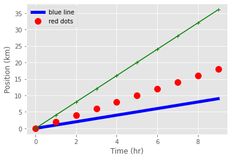
    


```python
plt.style.use("fivethirtyeight")
plt.plot(time, p1,color='blue', linestyle='-', linewidth=5,label="blue line")
plt.plot(time, p2,'ro', markersize=10, label="red dots")
plt.plot(time, p3,'g-', marker='+')
plt.xlabel("Time (hr)")
plt.ylabel("Position (km)")
plt.legend()
```


    <matplotlib.legend.Legend at 0x7f8cf0624d30>


    
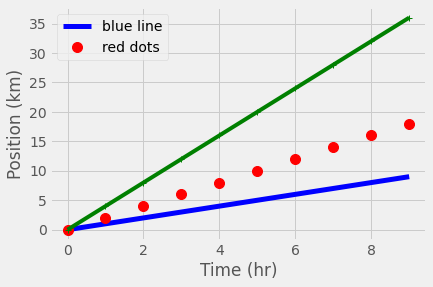
    


```python
plt.style.use("seaborn-whitegrid")
plt.plot(time, p1,linestyle='-', linewidth=5,label="blue line")
plt.plot(time, p2,'o', markersize=10, label="red dots")
plt.plot(time, p3,'-', marker='+') #where's the marker?
plt.xlabel("Time (hr)")
plt.ylabel("Position (km)")
plt.legend()
```


    <matplotlib.legend.Legend at 0x7f8cf0637670>


    
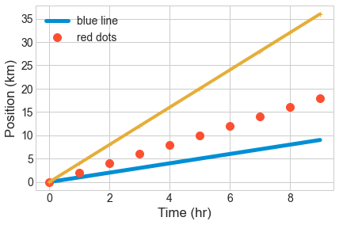
    


## Plots can be scatter plots with points and no lines


```python
numpy.random.seed(20)
x,y = numpy.random.randint(0,100,100), numpy.random.randn(100)
x=numpy.cumsum(x)
y=numpy.cumsum(y)

plt.scatter( x, y)
plt.scatter( x, 10-y**2, color='green',marker='<')
plt.xlabel("Labels still work")
plt.title("title")
```


    Text(0.5, 1.0, 'title')


    
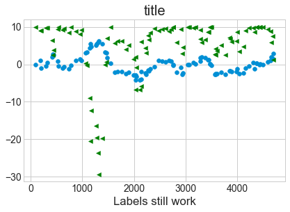
    


## Plot data with associated uncertainties  using `errorbar`
 * Don't join the data with a line by setting the `linestyle` to an empty string.
 * Set a marker shape using `marker`.
 * Use the same color for marker and errorbars.
 


```python
numpy.random.seed(42)
x = numpy.random.rand(10)*10
x=numpy.cumsum(x)
error  = numpy.random.randn(10)*4
y=x + numpy.random.randn(10)*0.5

plt.errorbar( x, y, yerr=error,color='green',marker='o',ls='',lw=1,label="data")
plt.xlabel("Labels still work")
plt.title("errorbar")
plt.legend()
```


    <matplotlib.legend.Legend at 0x7f8ce0f1bee0>


    
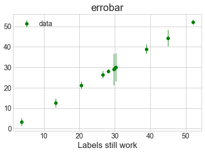
    


## `matplotlib` also makes bar charts and histograms
* If you have data grouped into counts already, `bar` can make a chart


```python
x = [0,1,2,3,4,5]
y = [0,4,2,6,8,2]
plt.bar(x,y)
plt.title("Bar chart")
```


    Text(0.5, 1.0, 'Bar chart')


    
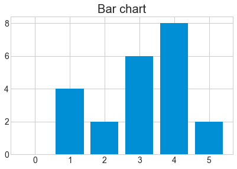
    


* If you have raw data, `hist` can calculate **and** plot the histogram.


```python
x = numpy.random.randint(0,100,50)
bin_count, bin_edges, boxes = plt.hist(x, bins=10)
print("The counts are ", bin_count)
```

    The counts are  [8. 5. 0. 5. 5. 6. 3. 6. 8. 4.]


    
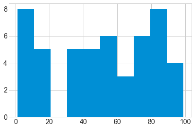
    


```python
bin_count, bin_edges, boxes = plt.hist(x, bins=10, rwidth=0.9)
plt.title("cleaner histogram")
```


    Text(0.5, 1.0, 'cleaner histogram')


    
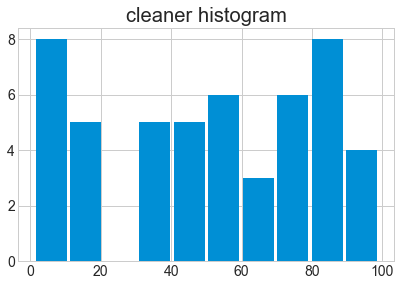
    


```python
# Compute pie slices
N = bin_count.size
theta = 0.5*(bin_edges[1:] + bin_edges[:-1])
theta = theta * 2*numpy.pi/theta.max()
width = numpy.pi / 4 * numpy.random.rand(N)

ax = plt.subplot(111, projection='polar')
bars = ax.bar(theta, bin_count, width=width, bottom=0.0,alpha=0.5)

# Use custom colors and opacity
for r, bar in zip(bin_count, bars):
    bar.set_facecolor(plt.cm.viridis(r / bin_count.max()))
    bar.set_alpha(0.5)

t=plt.title("Something more exotic")
```


    
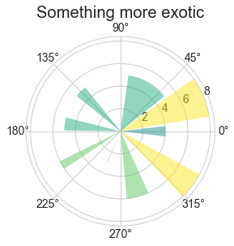
    


## Define the figure size before plotting using the `figure` command
* `plt.figure` pre-defines a figure for you
* The keyword `figsize` takes two values to define the width and height


```python
plt.figure(figsize=(8,2))
x = [0,1,2,3,4,5]
y = [0,4,2,6,8,2]
plt.bar(x,y)
plt.title("narrow bar chart")
```


    Text(0.5, 1.0, 'narrow bar chart')


    
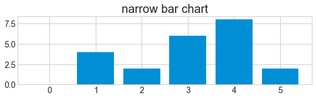
    


## Place multiple figures on one plot with `subplot`
* `plt.subplot` takes three arguments : (number_of_rows, number_of_columns, location)


```python
plt.figure(figsize=(8,2))
x = [0,1,2,3,4,5]
y = [0,4,2,6,8,2]
plt.subplot(2,2,1)
plt.bar(x,y)
plt.title("top left")
plt.subplot(2,2,2)
plt.bar(y,x)
plt.title("top right")
plt.subplot(2,2,4)
plt.bar(x,y)
plt.title("sometimes the formatting is awkward")
```


    Text(0.5, 1.0, 'sometimes the formatting is awkward')


    
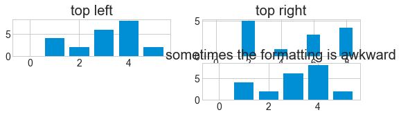
    


```python
plt.figure(figsize=(8,3))
x = [0,1,2,3,4,5]
y = [0,4,2,6,8,2]
plt.subplot(1,3,1)
plt.bar(x,y)
plt.title("top left")
plt.subplot(1,3,2)
plt.bar(y,x)
plt.title("top right")
plt.subplot(1,3,3)
plt.bar(x,y)
plt.title("less awkward")

```


    Text(0.5, 1.0, 'less awkward')


    
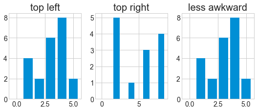
    


## Figures can be saved with `savefig`
* After plotting, use `plt.savefig` to save the figure to a file
* The figure size you specified is (approximately) the size in inches.
* For PNG/JPG images you can specify the resolution with `dpi`


```python
plt.figure(figsize=(8,3))
plt.plot(x,y)
plt.savefig("data/fig1.pdf") #PDF format
plt.savefig("data/fig1.png", dpi=150, transparent=True) #PNG format
```


    
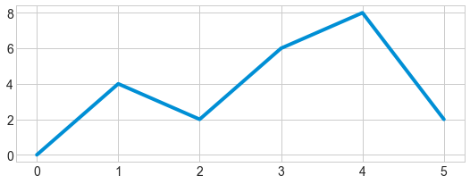
    


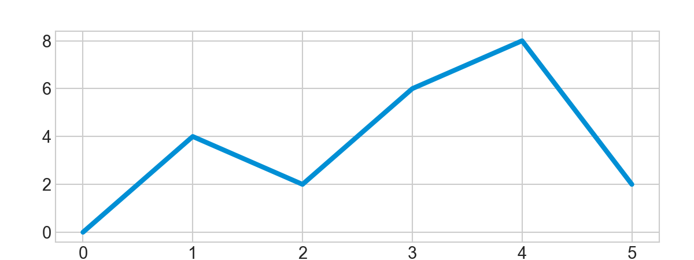


## Keypoints
* `matplotlib` is the most widely used scientific plotting library in Python.
* Plot data directly from a Pandas dataframe.
* Select and transform data, then plot it.
* Many styles of plot are available: see the Python Graph Gallery for more options.
* Can plot many sets of data together.
* Plots can be saved with `savefig`.
